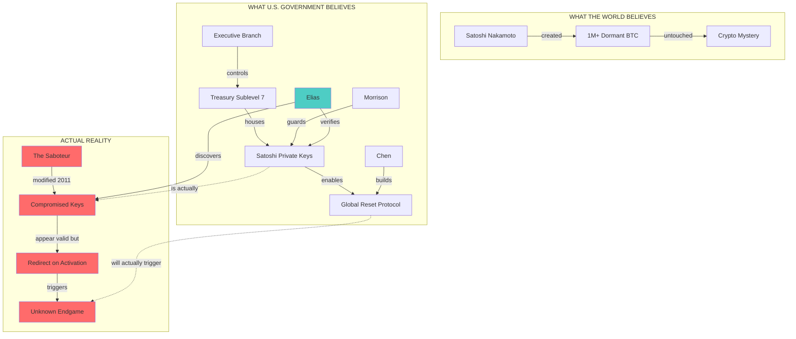

# Satoshi Keys - Layers of Control and Illusion

## The Core Paradox

The novel's engine: **What people believe they control ≠ What they actually control**

This diagram maps three layers:
1. **Surface Layer** - What the world sees
2. **Shadow Layer** - What insiders believe
3. **Truth Layer** - What actually exists

---

## ASCII Diagram: The Illusion Stack

```
╔══════════════════════════════════════════════════════════════════════════╗
║                        SURFACE LAYER (Public Reality)                     ║
║                                                                          ║
║    "Satoshi Nakamoto" ─────────────────────────────────────────────────→ ║
║         │                                                                ║
║         │ (public belief: anonymous genius, disappeared 2011)            ║
║         │                                                                ║
║         ▼                                                                ║
║    [1M+ DORMANT BTC] ──── "Untouched since creation"                     ║
║                                                                          ║
╠══════════════════════════════════════════════════════════════════════════╣
║                        SHADOW LAYER (U.S. Government Belief)              ║
║                                                                          ║
║    ┌─────────────┐                                                       ║
║    │  TREASURY   │◄────── Executive Branch                               ║
║    │  Sublevel 7 │        (believes they have the weapon)                ║
║    └──────┬──────┘                                                       ║
║           │                                                              ║
║           ▼                                                              ║
║    ┌─────────────┐      ┌─────────────┐      ┌─────────────┐            ║
║    │    CHEN     │      │  MORRISON   │      │   ELIAS     │            ║
║    │ (activation │      │ (security   │      │ (discovers  │            ║
║    │  protocol)  │      │  theater)   │      │  the truth) │◄─── ENTRY  ║
║    └─────────────┘      └─────────────┘      └─────────────┘     POINT   ║
║           │                    │                    │                    ║
║           └────────────────────┼────────────────────┘                    ║
║                                │                                         ║
║                                ▼                                         ║
║                    [KEYS IN FARADAY VAULT]                               ║
║                    "Ready for activation"                                ║
║                                                                          ║
╠══════════════════════════════════════════════════════════════════════════╣
║                        TRUTH LAYER (Actual Reality)                       ║
║                                                                          ║
║                         ┌──────────────┐                                 ║
║                         │  THE SABOTEUR│ ◄─── Identity = Core Mystery    ║
║                         │   (unknown)  │                                 ║
║                         └──────┬───────┘                                 ║
║                                │                                         ║
║                    ┌───────────┼───────────┐                             ║
║                    │           │           │                             ║
║                    ▼           ▼           ▼                             ║
║              ┌──────────┐ ┌──────────┐ ┌──────────┐                      ║
║              │Signature │ │ Root Key │ │ Redirect │                      ║
║              │ Modified │ │Compromised│ │ Embedded │                      ║
║              │  (2011)  │ │  (2011)  │ │  (2011)  │                      ║
║              └──────────┘ └──────────┘ └──────────┘                      ║
║                    │           │           │                             ║
║                    └───────────┼───────────┘                             ║
║                                │                                         ║
║                                ▼                                         ║
║              ┌────────────────────────────────────┐                      ║
║              │   IF ACTIVATED:                    │                      ║
║              │   • Treasury loses control         │                      ║
║              │   • Funds redirect to [???]        │                      ║
║              │   • Global financial cascade       │                      ║
║              │   • Saboteur's true plan executes  │                      ║
║              └────────────────────────────────────┘                      ║
║                                                                          ║
╚══════════════════════════════════════════════════════════════════════════╝
```

---

## Mermaid Diagram: Stakeholder Knowledge Map



---

## Matrix: Who Knows What

|                    | Keys Exist | U.S. Has Keys | Keys Compromised | Saboteur Identity |
|--------------------|:----------:|:-------------:|:----------------:|:-----------------:|
| **Public**         | Suspects   | No            | No               | No                |
| **Treasury**       | Yes        | Yes           | No               | No                |
| **Chen**           | Yes        | Yes           | No               | No                |
| **Morrison**       | Yes        | Yes           | No               | No                |
| **Elias** (start)  | Yes        | Yes           | No               | No                |
| **Elias** (after)  | Yes        | Yes           | **YES**          | Hunting           |
| **Saboteur**       | Yes        | Yes           | Yes              | **SELF**          |
| **BRICS Powers**   | Suspects   | Suspects      | No               | No                |
| **Crypto Community**| Myths     | No            | No               | No                |

---

## Flow Diagram: What Happens If Activated

```
CHEN INITIATES PROTOCOL
         │
         ▼
┌─────────────────────────────────┐
│ Treasury expects:               │
│ • Controlled BTC liquidation    │
│ • Dollar strengthening          │
│ • BRICS economic destabilization│
│ • Maintained U.S. hegemony      │
└────────────────┬────────────────┘
                 │
                 ▼ ACTUALLY
┌─────────────────────────────────┐
│ What happens:                   │
│ • Signature verification fails  │
│ • OR funds redirect elsewhere   │
│ • OR cascade failure triggers   │
│ • OR [SABOTEUR'S ACTUAL PLAN]   │
└────────────────┬────────────────┘
                 │
                 ▼
┌─────────────────────────────────┐
│ Possibilities:                  │
│ A) Global financial collapse    │
│ B) Wealth transfer to unknown   │
│ C) Deadman's switch activates   │
│ D) Something we haven't imagined│
└─────────────────────────────────┘
```

---

## Stakeholder Motivation Web

```
                              [GLOBAL STABILITY]
                                     ▲
                                     │
                    ┌────────────────┼────────────────┐
                    │                │                │
              [U.S. HEGEMONY]  [BRICS RISE]  [CRYPTO IDEALISM]
                    │                │                │
                    │                │                │
              ┌─────┴─────┐    ┌─────┴─────┐   ┌─────┴─────┐
              │ Treasury  │    │  China    │   │ True      │
              │ (weapon)  │    │  Russia   │   │ Believers │
              │           │    │  (counter)│   │ (freedom) │
              └─────┬─────┘    └─────┬─────┘   └─────┬─────┘
                    │                │                │
                    └────────────────┼────────────────┘
                                     │
                                     ▼
                              [SATOSHI KEYS]
                                     │
                                     │
                              ┌──────┴──────┐
                              │  SABOTEUR   │
                              │  Motivation:│
                              │  ?????????  │
                              └─────────────┘
```

**Key Question**: What does the Saboteur want?
- Chaos? (nihilist)
- Transfer? (theft)
- Prevention? (idealist stopping weaponization)
- Something else? (emergent/AI theory)

---

## Reflection

**What this diagram revealed**:

1. **The three-layer structure is clean** - Public myth / Government belief / Hidden truth works as narrative architecture. Each layer has its own internal logic that makes sense until the next layer reveals the crack.

2. **Elias is the bridge** - He's the only character who moves between layers. His journey IS the plot: from Shadow Layer believer to Truth Layer discoverer.

3. **The Saboteur motivation gap is critical** - The diagram exposes that the antagonist's motivation is undefined. This needs to be solved. Options:
   - Idealist (preventing weaponization)
   - Thief (redirecting wealth)
   - Accelerationist (triggering chaos for rebuild)
   - Emergent entity (non-human actor - ties to AI themes)
   - Original Satoshi (protecting their creation)

4. **The "what happens if activated" question is underdeveloped** - The diagram shows we know the activation will fail but not WHAT KIND of failure. This affects stakes dramatically.

5. **BRICS powers are underrepresented** - They exist as background threat but don't have active agents in this map. Opportunity for antagonist complexity?

**Questions raised**:
- Does the Saboteur know about the government's possession, or did they modify the keys preemptively in 2011?
- Is there a fourth layer? (Someone who knows about the Saboteur?)
- What's the timeline between Elias's discovery and Chen's activation attempt?

**Structural insight**: The novel's tension comes from dramatic irony - reader learns with Elias, but Treasury keeps moving toward activation unaware. Classic thriller countdown structure.
